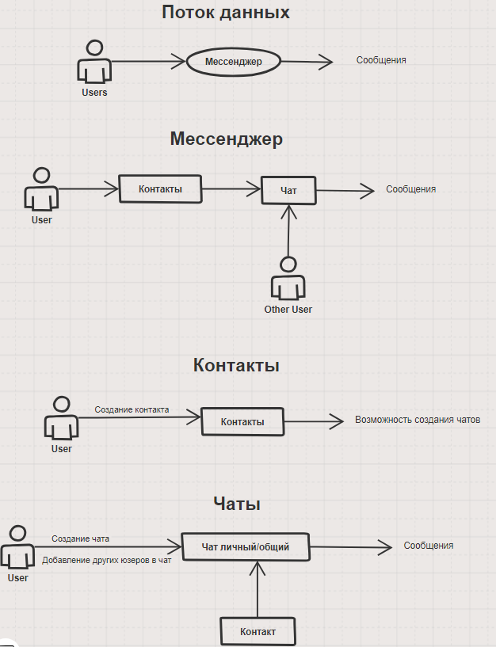
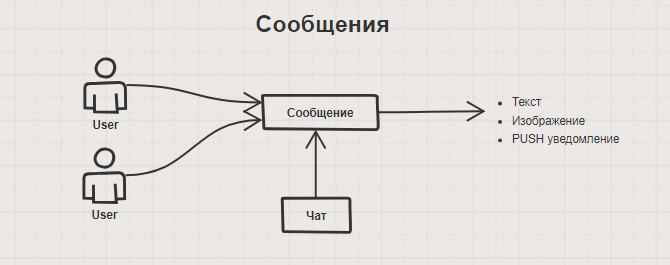
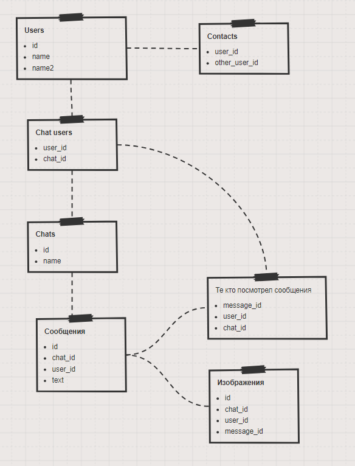

# System Design Messanger

## ТЗ 

### Требования к системе:

- Сезонности у системы нет;
- Системой будут пользоваться по всему миру;
- Приложение будет показывать непрочитанные сообщения;
- Приложение будет поддерживать чаты и личные сообщения;
- Отправлять можно только текст и картинки в сообщениях;
- Приложение должно показывать статусы онлайн/оффлайн пользователей, а также когда пользователь был последний раз в сети;
- Максимальный размер изображения в сообщении = 1МБ;
- Максимальное кол-во изображений в сообщении = 3;
- Максимальный размер текста в сообщении = 2000 символов;
- Клиентами будут мобильные, десктопные и WEB приложения;
- 200 000 000 уникальных пользователей заходят в приложение каждый день;
- Каждый пользователь в среднем отправляет 10 сообщений в день;
- Каждый пользователь в среднем просматривает сообщения 20 раз в день;
- Система должна работать 24 на 7 (допустимо 4 часа и 23 минуты простоя в год);
- Сообщение до получателя должно успевать доходить за 5 секунд (*если пользователя нет в сети - ему должно прийти Push уведомление на мобильный телефон*);
- Приложение должно поддерживать кросс-девайсную синхронизацию (*если у вас это приложение открыто на телефоне и ноутбуке, и например вы прочитали сообщение на телефоне, то сообщение должно отобразиться прочитанным и на ноутбуке*);

### Дополнительно:

- Фронтенд проектировать не нужно (*концентрируемся только на бэкенде*)
- Аутентификацию проектировать не нужно (*представим, что эта часть системы уже кем-то реализована*)
- Расчет нагрузки и потребления памяти от основных операций.
- Модель данных (*описать основные сущности в БД и как они взаимосвязаны*);
- API (*расписывать REST или GraphQL не нужно - просто словами опишите основные операции над вашей системой*);
- Верхнеуровневое проектирование основных компонентов системы и их отношений с другими компонентами системы;

## Проектирование

### **Расчет нагрузки**

RPS = dau * requests_number_per_day

RPS = 200_000_000 * 5 =  200000000 * 30 / 86400 = 69 444 гб

RPS = 200_000_000 * 5 =  200000000 * 10 / 86400 = 23 148 гб

RPS = 200_000_000 * 5 =  200000000 * 20 / 86400 = 46 296 гб

### **Расчет трафика**

0.5 мб взят за средний объем одного сообщения потребляемого пользователями

Traffic = rps * entity_size

Traffic per second на чтение = 46 296 * 0.5 мб = 23 гб

Traffic per second на запись = 23 148 * 0.5 мб = 11 гб

Traffic per day на запись = 1 пб

### **Оценка ресурсов**

Расчет без учета репликации. Посчитан только трафик на запись.

Диски HDD Пропускная способность 100 мб, задержка 2мс, операций 100, объем 32 тб

СAPACITY = traffic_per_second * 86 400 * 365  = 11 * 86 400 * 365 = 346 пб

DISK_NUMBER_FOR_CAPACITY = СAPACITY / disk_capacity = 346 000 / 32 = 11000 шт

DISK_NUMBER_FOR_THROUGPUT = traffic_per_second / disk_throughput = 11 гб / 100мб = 113 шт

NUMBER_OF_DISKS = max(DISK_NUMBER_FOR_CAPACITY, DISK_NUMBER_FOR_THROUGPUT) = 11000 шт

### Потоки данных

### Сущности в БД

